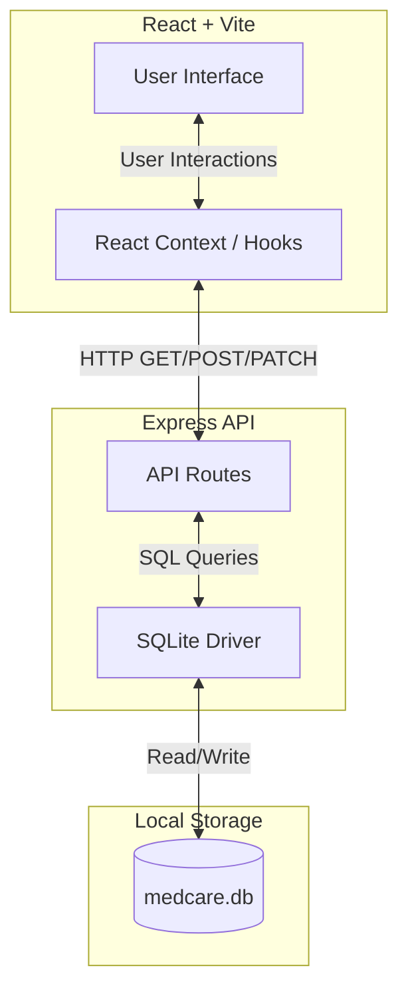

# MedCare


A prototype full-stack healthcare application demonstrating end-to-end integration of a React frontend with a local Node.js/Express backend and SQLite database. 

## 🏥 About MedCare

MedCare is a conceptual digital healthcare platform designed to simplify patient-doctor interactions and manage medical needs in one unified dashboard. It is a fully functional CRUD (Create, Read, Update, Delete) prototype.

### Key Features
- **Appointment Booking:** Patients can browse available doctors by specialty and book consultations.
- **Patient Dashboard:** A centralized hub to view upcoming appointments and upload/manage medical records.
- **Medicine Shop:** An e-commerce module to search for prescribed medicines and add them to a cart.
- **Tablet Reminders:** A daily tracker for patients to mark whether they've taken their scheduled doses.
- **Emergency Services & Symptom Checker:** Quick-access tools for urgent care and basic health assessments.

## 🏗️ System Architecture

MedCare uses a modern, lightweight tech stack. To prevent data loss and ensure a sandboxed environment for testing, the platform relies exclusively on a local SQLite database rather than external cloud databases.



## 💻 Local Development Setup

1. **Install Dependencies**
   ```bash
   npm install
   ```

2. **Initialize Database**
   Seeds the SQLite database with demo data (doctors, medicines, appointments).
   ```bash
   node server/seed.js
   ```

3. **Start Servers Concurrently**
   Starts both the Vite development server (`http://localhost:5173`) and the Express API server (`http://localhost:3001`).
   ```bash
   npm run dev:full
   ```

## 🧪 Testing Validation

The platform includes robust automated testing to ensure the frontend accurately reflects the backend database state.

### Backend API Validation
Executes raw CRUD operations against the SQLite database via the Express endpoints:
```bash
node server/test_api.js
```

### End-to-End Workflows
Runs the Playwright suite simulating real user workflows (Appointment booking, authentication, etc.).
- **Headless execution:**
  ```bash
  npx playwright test
  ```
- **Visual execution with slow-motion tracing:**
  ```bash
  python3 visual_test.py
  ```

## 📜 Attributions

- UI Components from [shadcn/ui](https://ui.shadcn.com/) (MIT License).
- Stock photography from [Unsplash](https://unsplash.com) (Unsplash License).