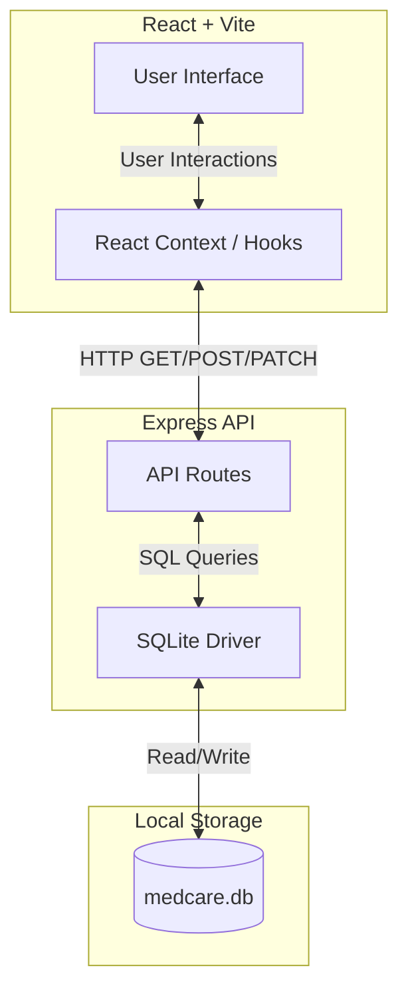

# MedCare


A prototype full-stack healthcare application demonstrating end-to-end integration of a React frontend with a local Node.js/Express backend and SQLite database. 

## 🏥 About MedCare

MedCare is a conceptual digital healthcare platform designed to simplify patient-doctor interactions and manage medical needs in one unified dashboard. It is a fully functional CRUD (Create, Read, Update, Delete) prototype.

### Key Features
- **Appointment Booking:** Patients can browse available doctors by specialty and book consultations.
- **Patient Dashboard:** A centralized hub to view upcoming appointments and upload/manage medical records.
- **Medicine Shop:** An e-commerce module to search for prescribed medicines and add them to a cart.
- **Tablet Reminders:** A daily tracker for patients to mark whether they've taken their scheduled doses.
- **Emergency Services & Symptom Checker:** Quick-access tools for urgent care and basic health assessments.

## 🏗️ System Architecture

MedCare uses a modern, lightweight tech stack. To prevent data loss and ensure a sandboxed environment for testing, the platform relies exclusively on a local SQLite database rather than external cloud databases.



## 🚀 Quick Start Guide

Follow these steps to set up and run the application locally.

### 📋 Prerequisites

Ensure the following environments are installed:
1. **Node.js** (LTS version recommended) — [Download here](https://nodejs.org/)
2. **Python** (Version 3.7 or newer) — [Download here](https://www.python.org/)

---

### 🛠️ Step 1: Install Dependencies

1. Open a terminal or Command Prompt.
2. Navigate to the project root directory:
   ```bash
   cd medcare-prototype
   ```
3. Install the required package dependencies:
   ```bash
   npm install
   ```

---

### 🌱 Step 2: Start the Application

Run the startup script to initialize/seed the database and start both the frontend and backend servers concurrently:

```bash
python start.py
```

* **Access the Application:** Once initialized, open a web browser and navigate to **`http://localhost:5173`**.
* **Shutdown:** Press `Ctrl + C` in the terminal to terminate the active servers.

---

### 🧪 Step 3: Execute End-to-End Tests

To run the automated validation suite with visual visual-motion tracking:

```bash
python visual_test.py
```

* **Behavior:** The script initiates Playwright and launches a headed browser to execute end-to-end user workflows (authentication, booking, checkout, and reminders) sequentially.
* **Initialization Note:** On the initial execution, Playwright will automatically install the necessary browser binaries.

## 📜 Attributions

- UI Components from [shadcn/ui](https://ui.shadcn.com/) (MIT License).
- Stock photography from [Unsplash](https://unsplash.com) (Unsplash License).
